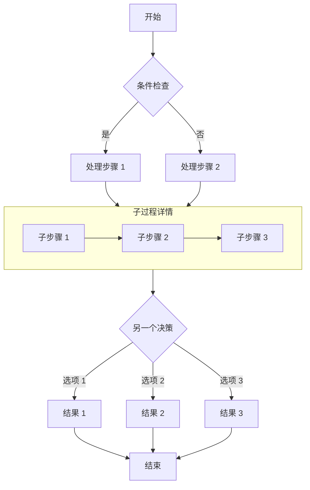

## 吼吼~恭喜你解锁隐藏内容！

如果你能看到这段内容，说明咱俩的关系已经又进一步了···

### 功能说明

- **为什么加密？**：emm···最主要的原因就是我不想影响你的高考！但是我有时候实在想给你说一些我的心里话，不过我猜这些心里话大多都会影响你的复习节奏···于是只能把想说的话放在加密文章里。

### 主要内容

- **2026.5.20**：如果你能看到这些话了，就意味着我盼望好久的那一天到来了！如果你没有机会看到这个的话···我想这一切就都没有了意义，可能几个月或者几年后我才能缓过来吧（😭）
- **2026.5.20**：啊啊啊！我好想和你待在一起啊！我心里真的好急啊今天！
- **2026.5.20**：5.18那次梦里我终于和你在一起了，牵手拥抱逛街亲嘴，一切都是那么美好~
- **2026.5.21**：我完全理解且支持你这几天甘青宁考试必须要早睡，我也希望这样！希望你能调整好状态！但是…突然间的改变，自私地且没分清主要矛盾地来看，我还是好难过啊…我怕这种失去的感觉，因为这让我再次感受到那种强烈的孤独感，又变成了孤身一人，我怕这种感觉…（凌晨）
- **2026.5.21**：上面那句话就是我今天一整天那么想你！状态很奇怪的原因…
- **2026.5.21**：依旧很想你！我实在想把这些话给你说出来，只能借助这么一种有些无可奈何的方式写给你听了（即使你完全看不到目前），让我“欺骗欺骗”自己吧。
- **2026.5.23**：嗨嗨！心情又变好了！心态已经调整好了～哪怕每天的聊天时间很短，但只要是认真对待的，又何必伤心呢？因为是认真对待的，所以我不是孤独的！有人在陪我！哪怕时间很短，但那也是用心地陪伴！（凌晨）
- **2026.5.23**：这几天一直在搞blog这个更大的项目，以至于这边的更新懈怠了，但今天又经历了一下5.20开始的事，你再次早睡了。或许是因为你放学回来得早，咱俩的聊天时间没那么短，以至于我的心情还不错～没有那一次的那么难过焦急…嘿嘿，而且我也真心希望你最后能取得一个好的结果！
- **会话缓存**：同一浏览器会话内，密码会被缓存到 `sessionStorage`，刷新页面无需重复输入。
- **关闭即失效**：关闭浏览器后缓存清除，再次访问需要重新输入密码。

> 密码为 `123456`，仅供测试使用。

## 图片


## GitHub 仓库卡片

::github{repo="CuteLeaf/Firefly"}

## 提示框

> [!NOTE] NOTE
> 突出显示用户应该考虑的信息。

> [!TIP] TIP
> 可选信息，帮助用户更成功。

> [!NOTE] 自定义标题
> 这是一个带有自定义标题的示例。

## 数学公式
### 行内公式 (Inline)

欧拉公式 $e^{i\pi} + 1 = 0$ 是数学中最优美的公式之一。

质能方程 $E = mc^2$ 也是家喻户晓。

### 块级公式 (Block)

块级公式使用两个 `$$` 符号包裹，会居中显示。

$$
\int_{-\infty}^{\infty} e^{-x^2} dx = \sqrt{\pi}
$$

$$
x = \frac{-b \pm \sqrt{b^2 - 4ac}}{2a}
$$

### 化学方程式 (Chemical Equations)

$$
\ce{CH4 + 2O2 -> CO2 + 2H2O}
$$

## 代码块
#### 常规语法高亮

```js
console.log('此代码有语法高亮!')
```

#### 渲染 ANSI 转义序列

```ansi
ANSI colors:
- Regular: Red Green Yellow Blue Magenta Cyan
- Bold:    Red Green Yellow Blue Magenta Cyan
- Dimmed:  Red Green Yellow Blue Magenta Cyan

256 colors (showing colors 160-177):
160 161 162 163 164 165
166 167 168 169 170 171
172 173 174 175 176 177

Full RGB colors:
ForestGreen - RGB(34, 139, 34)

Text formatting: Bold Dimmed Italic Underline
```


## 流程图


